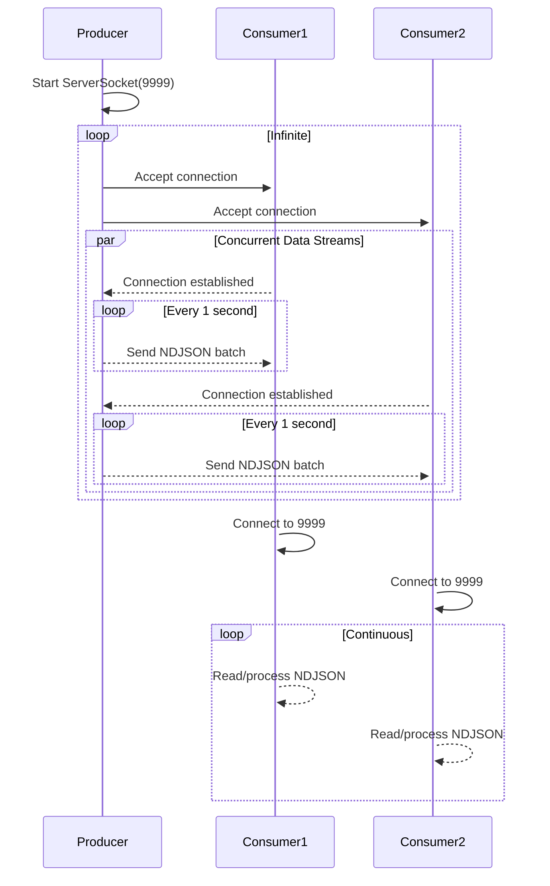

# Windows Log Streaming System Architecture

## Overview
A dual-component system for generating and consuming Windows-style event logs over TCP:



- **DataProducer**: TCP server generating synthetic Windows event logs
- **DataConsumer**: TCP client reading and processing log streams

## Components

### DataProducer App
```text
src/
└── DataProducer.java
```

Key Responsibilities:
- Creates thread-per-client TCP server on port 9999
- Generates randomized Windows event data
- Maintains 1-second interval between NDJSON batches
- Handles multiple concurrent connections

### DataConsumer App
```text
src/
└── DataConsumer.java
```

Key Responsibilities:
- Establishes TCP connection to producer
- Continuously reads NDJSON lines
- Validates message structure
- Processes log events

## Data Schema
```json
{
  "eventId": 4624,
  "level": "Information",
  "source": "Security",
  "timestamp": "2025-03-05T17:44:30Z",
  "computer": "SERVER01",
  "user": "SYSTEM",
  "message": "An account was successfully logged on"
}
```

## Implementation Details

### Producer Features
- Randomized event parameters:
  - Event IDs: Security (4624, 4625), System (7036), Application (1000)
  - Dynamic timestamps
  - Multiple log sources (Security/System/Application)
- Connection timeout handling (30s)
- Graceful shutdown on SIGINT

### Consumer Features
- JSON schema validation
- Error handling for malformed entries
- Basic event statistics collection
- Connection retry logic

## Validation Plan
1. **Smoke Test**  
   `nc localhost 9999` - Verify data stream

2. **Concurrency Test**  
   Launch 5 parallel consumers

3. **Format Validation**  
   Check NDJSON structure with jq:
   ```bash
   jq -c '. | {eventId,level}' <(tail -n 100 producer.log)
   ```

4. **Throughput Test**  
   Measure messages/second across connections

## Security Considerations
- Localhost-only communication
- No sensitive data in synthetic logs
- Connection timeouts prevent hung threads