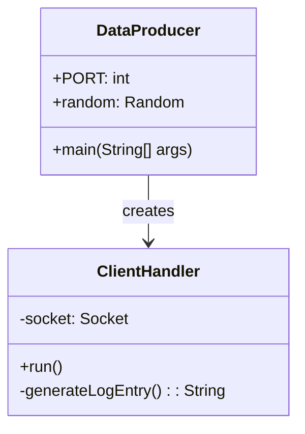
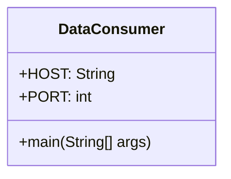
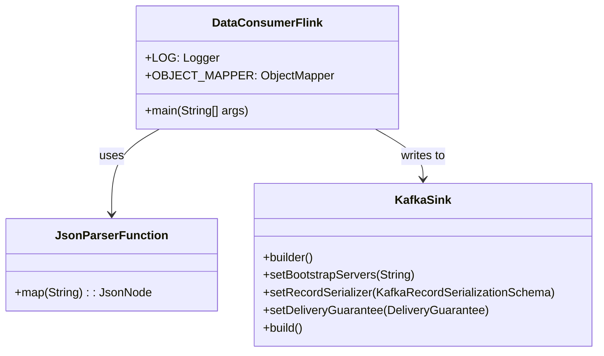

# Real-time Event Processing Pipeline with Kafka

A distributed data processing system that demonstrates real-time event ingestion and analysis using Java, Apache Flink, and Apache Kafka.

## Architecture Overview

This project implements a data pipeline with the following components:
- A data producer that generates synthetic Windows event log data
- A Flink-based stream processing application that ingests data and writes to Kafka
- Apache Kafka for reliable message queuing
- A Kafka UI for monitoring and managing Kafka topics


## Components

### DataProducer

A Java application that generates synthetic Windows event log data in NDJSON format and serves it over a TCP socket.



**Key Features:**
- Multi-threaded TCP server that accepts multiple client connections
- Generates random Windows event log entries in JSON format
- Simulates various event types from different sources (Security, System, Application)
- Continuously streams data at regular intervals

**Implementation Details:**
- Uses Java's ServerSocket to listen for client connections
- Employs a thread pool to handle multiple clients concurrently
- Generates structured event data with timestamps, levels, sources, and messages

### DataConsumer

A simple Java client that connects to the DataProducer and displays the received events.



**Key Features:**
- Connects to the DataProducer's TCP socket
- Reads JSON events as they arrive
- Prints events to the console
- Handles connection and I/O errors gracefully

**Implementation Details:**
- Uses Java's Socket API to establish a TCP connection
- Parses the incoming data stream line by line
- Simple and lightweight design for basic data consumption

### DataConsumerFlink

An Apache Flink application that performs real-time stream processing on the event data and writes the results to Kafka.



**Key Features:**
- Connects to the DataProducer via Flink's socketTextStream
- Parses JSON data into structured records
- Extracts and processes event information
- Writes processed events to Kafka with at-least-once delivery guarantee

**Implementation Details:**
- Uses Flink's DataStream API for stream processing
- Implements custom functions for parsing and mapping JSON data
- Uses Flink's Kafka connector for reliable message delivery
- Configures proper error handling to maintain stream integrity
- Supports parameterization of hostnames, ports, and Kafka settings

## Configuration Files

### pom.xml

Maven configuration file for the DataConsumerFlink application.

**Purpose:**
- Defines project metadata and build configuration
- Specifies dependencies required for the Flink application
- Configures plugins for compilation and packaging

**Key Components:**
- Flink dependencies (streaming-java, clients) with "provided" scope
- JSON processing libraries for handling the event data
- Logging configuration with Log4j2
- Maven plugins for compilation and creating an executable JAR

### docker-compose.yml

Docker Compose configuration for running a Flink cluster.

**Purpose:**
- Defines a multi-container Flink environment
- Configures the Flink JobManager and TaskManager services
- Specifies networking and scaling parameters

**Key Components:**
- JobManager service for coordinating Flink jobs
- TaskManager service for executing Flink tasks
- Environment variables for Flink configuration
- Port mappings for accessing the Flink UI

## Running the Project

### Start the Flink Cluster
```bash
docker-compose up -d
```

### Run the DataProducer
```bash
cd DataProducer
javac src/DataProducer.java
java -cp src DataProducer
```

### Run the DataConsumer (Optional)
```bash
cd DataConsumer
javac src/DataConsumer.java
java -cp src DataConsumer
```

### Build and Submit the DataConsumerFlink App
```bash
# Build the application JAR
cd DataConsumerFlink
mvn clean package
```

#### Method 1: Submit via Container (Recommended)
This is the approach we actually used for this project:

```bash
# Copy the JAR file to the JobManager container
docker cp target/DataConsumerFlink-1.0-SNAPSHOT.jar apache_streampark-jobmanager-1:/tmp/

# Execute the job directly within the container with the host IP address
docker exec -it apache_streampark-jobmanager-1 flink run -d /tmp/DataConsumerFlink-1.0-SNAPSHOT.jar --hostname 172.21.40.99 --port 9999
```

Note: Replace `172.21.40.99` with your actual host machine IP address. You can find it with:
```bash
# On Linux
ip addr show | grep "inet " | grep -v 127.0.0.1

# On macOS
ifconfig | grep "inet " | grep -v 127.0.0.1
```

#### Method 2: Submit via Flink Web UI
An alternative approach using the Flink Web UI:

1. Open your browser and navigate to http://localhost:8081
2. Click on "Submit New Job"
3. Click "Add New" to upload the JAR file
4. Browse and select `target/DataConsumerFlink-1.0-SNAPSHOT.jar`
5. After uploading, click on the JAR file name in the list
6. In the "Entry Class" field, verify it shows "com.example.DataConsumerFlink"
7. Add the following program arguments: `--hostname 172.21.40.99 --port 9999`
   - Replace `172.21.40.99` with your actual host machine IP address
8. Click "Submit" to start the job

### Monitor Processing Results
- View the Flink UI at http://localhost:8081
- Check the TaskManager logs for processing results:
```bash
docker logs $(docker ps | grep taskmanager | awk '{print $1}')
```

> **Note on Metrics**: When using socketTextStream in Flink, you may notice that metrics in the Flink UI (such as Bytes Received, Records Received, Bytes Sent, and Records Sent) show 0 even though the application is working correctly. This is a known limitation of the socketTextStream source, which doesn't properly report metrics to Flink's metrics system. The absence of these metrics does not indicate a problem with your application. To verify that data is flowing, check the TaskManager logs as shown above. For production deployments where detailed metrics are critical, consider using other sources like Kafka connectors which provide comprehensive metrics reporting.

## Fault Tolerance and Behavior
Infrastructure
```bash
# Start the c, KWfka, ZooKeeper, and Kafka UIt happens if the DataProducer stops?

n the DataProducer application stops:
1*CCocknthum ell se*viTh *ae rnnning
doskum- omposeFpl

# Se tp Ktfke toeibs ind pepmissiens
./setip-kafka.shcally attempt to reconnect to the socket
   - You'll see connection retry attempts in the TaskManager logs
   - The job remains in "RUNNING" state in the Flink UI
   - When the DaPradocuc, the Flink job will automatically reconnect and resume processing

This bePradoc makes the Flink application resilient to temporary producer failures or restarts. To completely stop the job, you need to cancel it explicitly through the Flink UI or CLI:
Prdc
```bashPrdc
# Cancel the job via CLI (you'll need the job ID from the Flink UI)
docker exec -it apache_streampark-jobmanager-1 flink cancel <job_id>
d-c-f and Kafka configurationd-c-f \
  \
 99 \
  --kafka-bootstrap-servers kafka:02 \  --kafka-topic events_processed \
  --kafka-security-protocol SASL_PLAINTEXT
d-c-f
  ``
   99 --kafka-bootstrap-servers kafka:02 --kafka-topic events_processed --kafka-security-protocol SASL_PLAINTEXT
   ``the ipl

#### Fink UIdail####Kafka UI
- Access hKafka UI at http://lcalhost:8080
-onio top
  - View topics list andtir cofigratos
  -Che mssag couns ndpartitodistributo
 - Brwseessgesi he tops
-Moniorconsus:
  - Trak conumergroups adirag
- View conmerofftand prossng rats

####Vifying Data Flow
```bah
#Vwmsags i heKfkatopi
dckexec -iapac_strampark-kafka-1kafka-cnsole-consmer.s\
  --boostrap-srverkfka:9092 \
  --to evens_prcesed\
  --fom-begnin\
  --prpety pint.ky=rue \
  --propertkey.eparator=:\
--cosumer.cfig/ec/kafk/consumer.properes
```

> **NtenMerics**: Unlik, the KafkaconnectnFlikvidscompehensiv inhe UI,nludingbte/rcordsreceivdnd t.T are valuablefrmoitring hehelhndefrmancofdat iee

## Faultlerance andBehaior

### System Resilience

The intgaton oApaceKfkprovdes everalaut tlerabenefis:

1. **Mse Psistence**:Eventre afelytred iKfka tpics enif dwnsteamessors fal
2. **At-least-ceDiver**: Msags aguaranted o b processeven afe omponentfilus
3.**Consume Reslene**:Cumscan resmefrm ilat ffset after eovry
4.**Scalabity**:'spartitiig modl allworzontal saling of botucrs andu

###ComnenilreSrs##### What happens if Kafka stops?

Wen the Kafka broker temporarily unavailal:

1. **DataConsumerFlink**: Te Flink job will buffer dta n memory up to cnfigued limits:
   - Flink willattept to reconnect to Kafka with a bcoff stratgy
   - Once Kafka is available again, the buffered data will be written
   - If the buffer overflow, job may faildepending on configuration
   - With proper checkpointing,  can recovernd rerocess data after restart

2. **Dependent Consumers**: Any consumers reading from Kafka tos will:
   - Puse consumpn until Kafka is available agai
   - Resumefom thr ast commtted offst whe Kafka reurns
  - No lse anydaa du to Kafka's persistence odel

#### What hapens if the Flink job fails?

If the Flink jb fails and estts:

1. **Data Processing**: No data is lost because:
   - Data in Kafka topics remains available forreocessing
   - Flink's checkpinting ensres processing state is reoverable
   - Kafka consumofsets are committed ccordng to checkpoint competion

2. **Recovery Process**:
   - The job atomatically start (ifcnfigued)
   -Pocessing resumes from the last successful checkpoint
   - Exactly-once smantic can be mainined with prope configuraion

###Shutting Down Components


# To stop the entire infrastructure
docker-compose down