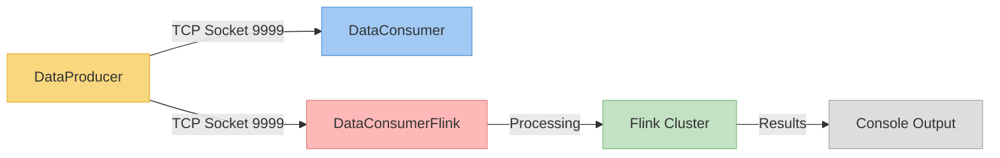
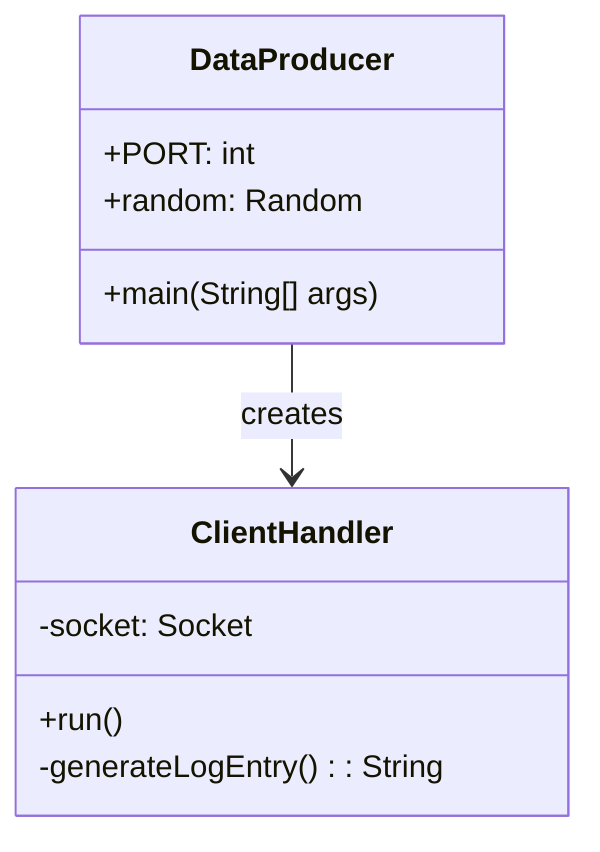
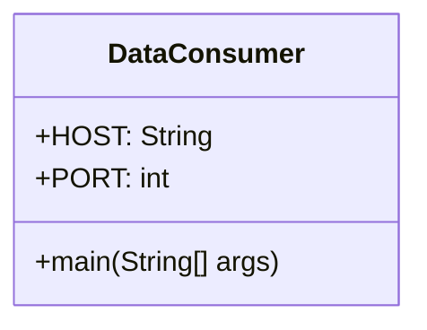
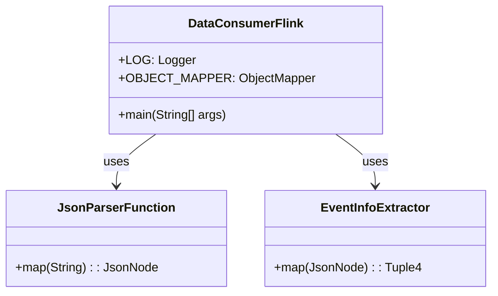

# Real-time Event Processing Pipeline

A distributed data processing system that demonstrates real-time event ingestion and analysis using Java and Apache Flink.

## Architecture Overview

This project implements a data pipeline with three main components:
- A data producer that generates synthetic Windows event log data
- A simple Java consumer that reads the data stream
- A Flink-based stream processing application that performs real-time analytics



## Components

### DataProducer

A Java application that generates synthetic Windows event log data in NDJSON format and serves it over a TCP socket.



**Key Features:**
- Multi-threaded TCP server that accepts multiple client connections
- Generates random Windows event log entries in JSON format
- Simulates various event types from different sources (Security, System, Application)
- Continuously streams data at regular intervals

**Implementation Details:**
- Uses Java's ServerSocket to listen for client connections
- Employs a thread pool to handle multiple clients concurrently
- Generates structured event data with timestamps, levels, sources, and messages

### DataConsumer

A simple Java client that connects to the DataProducer and displays the received events.



**Key Features:**
- Connects to the DataProducer's TCP socket
- Reads JSON events as they arrive
- Prints events to the console
- Handles connection and I/O errors gracefully

**Implementation Details:**
- Uses Java's Socket API to establish a TCP connection
- Parses the incoming data stream line by line
- Simple and lightweight design for basic data consumption

### DataConsumerFlink

An Apache Flink application that performs real-time stream processing on the event data.



**Key Features:**
- Connects to the DataProducer via Flink's socketTextStream
- Parses JSON data into structured records
- Extracts and formats event information
- Outputs processed events to the console

**Implementation Details:**
- Uses Flink's DataStream API for stream processing
- Implements custom functions for parsing and mapping JSON data
- Handles JSON processing with Jackson (via Flink's shaded version)
- Includes proper error handling to maintain stream integrity

## Configuration Files

### pom.xml

Maven configuration file for the DataConsumerFlink application.

**Purpose:**
- Defines project metadata and build configuration
- Specifies dependencies required for the Flink application
- Configures plugins for compilation and packaging

**Key Components:**
- Flink dependencies (streaming-java, clients) with "provided" scope
- JSON processing libraries for handling the event data
- Logging configuration with Log4j2
- Maven plugins for compilation and creating an executable JAR

### docker-compose.yml

Docker Compose configuration for running a Flink cluster.

**Purpose:**
- Defines a multi-container Flink environment
- Configures the Flink JobManager and TaskManager services
- Specifies networking and scaling parameters

**Key Components:**
- JobManager service for coordinating Flink jobs
- TaskManager service for executing Flink tasks
- Environment variables for Flink configuration
- Port mappings for accessing the Flink UI

## Running the Project

### Start the Flink Cluster
```bash
docker-compose up -d
```

### Run the DataProducer
```bash
cd DataProducer
javac src/DataProducer.java
java -cp src DataProducer
```

### Run the DataConsumer (Optional)
```bash
cd DataConsumer
javac src/DataConsumer.java
java -cp src DataConsumer
```

### Build and Submit the DataConsumerFlink App
```bash
# Build the application JAR
cd DataConsumerFlink
mvn clean package
```

#### Method 1: Submit via Container (Recommended)
This is the approach we actually used for this project:

```bash
# Copy the JAR file to the JobManager container
docker cp target/DataConsumerFlink-1.0-SNAPSHOT.jar apache_streampark-jobmanager-1:/tmp/

# Execute the job directly within the container with the host IP address
docker exec -it apache_streampark-jobmanager-1 flink run -d /tmp/DataConsumerFlink-1.0-SNAPSHOT.jar --hostname 172.21.40.99 --port 9999
```

Note: Replace `172.21.40.99` with your actual host machine IP address. You can find it with:
```bash
# On Linux
ip addr show | grep "inet " | grep -v 127.0.0.1

# On macOS
ifconfig | grep "inet " | grep -v 127.0.0.1
```

#### Method 2: Submit via Flink Web UI
An alternative approach using the Flink Web UI:

1. Open your browser and navigate to http://localhost:8081
2. Click on "Submit New Job"
3. Click "Add New" to upload the JAR file
4. Browse and select `target/DataConsumerFlink-1.0-SNAPSHOT.jar`
5. After uploading, click on the JAR file name in the list
6. In the "Entry Class" field, verify it shows "com.example.DataConsumerFlink"
7. Add the following program arguments: `--hostname 172.21.40.99 --port 9999`
   - Replace `172.21.40.99` with your actual host machine IP address
8. Click "Submit" to start the job

### Monitor Processing Results
- View the Flink UI at http://localhost:8081
- Check the TaskManager logs for processing results:
```bash
docker logs $(docker ps | grep taskmanager | awk '{print $1}')
```

## Fault Tolerance and Behavior

### What happens if the DataProducer stops?

When the DataProducer application stops:

1. **DataConsumer**: The simple Java client will terminate with an IOException when the socket connection is closed.

2. **DataConsumerFlink**: The Flink job will **continue running** but enter a reconnection loop:
   - Flink's socketTextStream source is designed to be fault-tolerant
   - The job will periodically attempt to reconnect to the socket
   - You'll see connection retry attempts in the TaskManager logs
   - The job remains in "RUNNING" state in the Flink UI
   - When the DataProducer restarts, the Flink job will automatically reconnect and resume processing

This behavior makes the Flink application resilient to temporary producer failures or restarts. To completely stop the job, you need to cancel it explicitly through the Flink UI or CLI:

```bash
# Cancel the job via CLI (you'll need the job ID from the Flink UI)
docker exec -it apache_streampark-jobmanager-1 flink cancel <job_id>